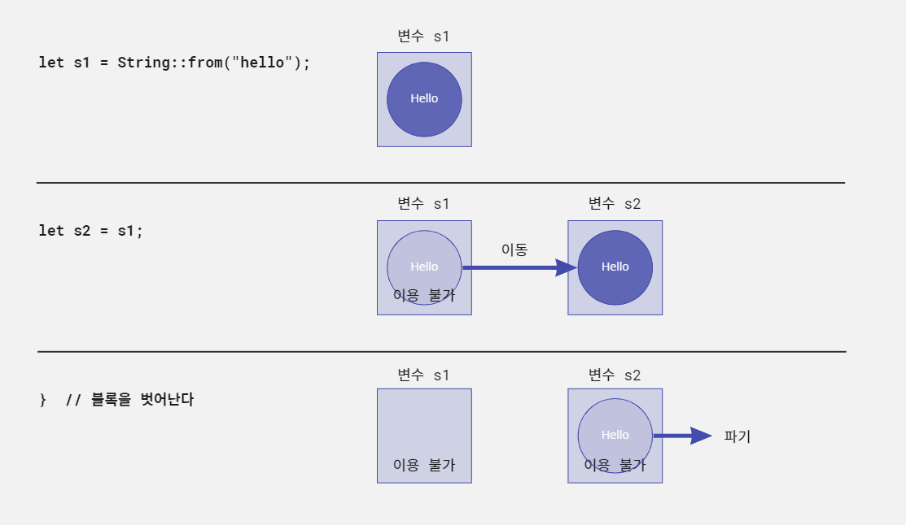
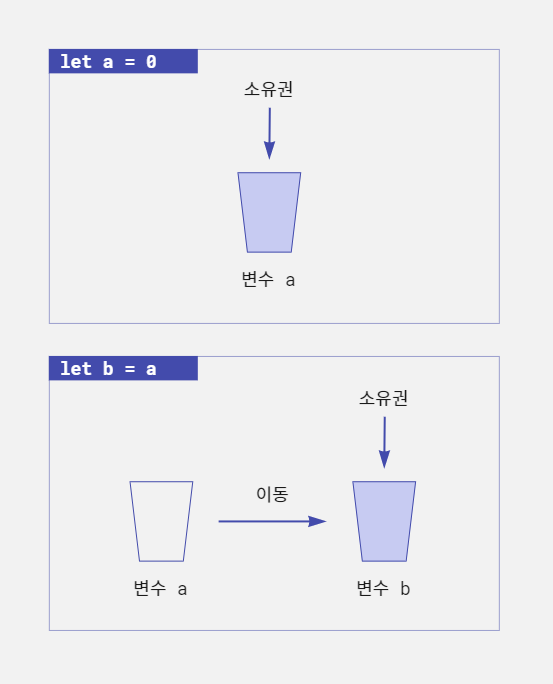
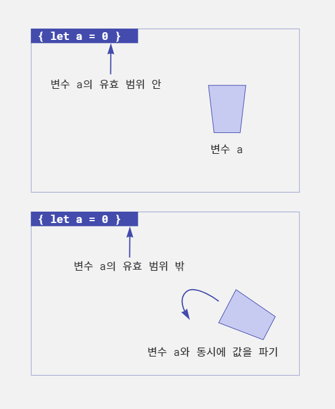

#패스트캠퍼스, #국비지원교육, #메가바이트스쿨, #MegabyteSchool, #개발자취업부트캠프, #내일배움카드

*last edited 2023.01.26*

# 러스트의 소유권 시스템에 대해 쉬운 설명으로 알아보자

> ▶ 만들면서 배우는 러스트 프로그래밍 -쿠지라 히코우즈쿠에- ◀ 을 참조하여 정리하였다.

러스트에는 메모리 안전성을 확보하기 위한 '소유권(ownership)'이라는 시스템이 있다. 이는 다른 언어에서는 없는 개념으로 러스트를 배우는데 있어서 첫번째 난관이 된다.

## 소유권 시스템이란 무엇인가

러스트는 안전성을 가지면서도 효율적인 고속 프로그래밍 언어다. 마찬가지로 효율적인 프로그래밍 언어인 C 언어는 메모리 관리가 어렵고, 메모리와 관련된 버그가 많이 발생한다. 안전성 향상에 큰 역할을 하는 것이 바로
이 소유권 시스템이다. 소유권 시스템은 러스트의 가장 중심이 된다고 해도 과언이 아니다.

### 소유권 시스템을 간단히 표현하면

소유권 시스템은 간단히 말하면 **확보한 메모리를 사용이 끝난 시점에 자동으로 파기하는 기능**이다. 확보한 메모리를 이용할 수 있는 범위를 명확히 한정 지어 효율적으로 메모리를 관리한다.

이 구조를 러스트 코드 형태로 확인해보자. 러스트에서는 중괄호를 이용해 임의의 장소에 블록을 선언할 수 있다.

(스포일러 주의! 예시에서 `String`타입을 사용했다는 것을 유념하자.)

```rust, noplayground
{
    // 여기서 String 메모리를 확보
    let s = String::from("hello");
    // ...
    // ... 여기서 변수 s를 이용한 처리를 수행
    // ...
}
// 블록을 벗어나면 변수 s의 메모리를 파기
```

이 예시는 기본적인 소유권 시스템의 동작을 나타낸다. 블록 안에서 확보된 메모리는 블록을 벗어나는 순간 자동으로 파기된다. 이처럼 러스트는 메모리의 유효 범위가 정해져 있다.

메모리를 확보한 후에 그 메모리를 누군가 책임지고 파기해야 하는 부분도 명확하게 정해져 있다.

예를 들어 다음과 같은 코드에서는 변수 `s1`에서 메모리를 확보한다. 그리고 도중에 변수 `s2`로 확보된 메모리가 이동된다.

```rust, noplayground
{
    // 여기서 메모리를 확보
    let s1 = String::from("hello");
    
    // 다른 변수에 값을 넘긴다
    let s2 = s1;
}
// 블록을 벗어나면 변수 s2의 메모리를 파기
```

이 경우 변수 `s1`에서 확보한 메모리는 `s2`로 이동된다. 변수 `s1`과 `s2`의 메모리를 모두 파기하려고 하면 메모리 이중 해제가 발생한다. 그래서 변수 `s1`에서 `s2`로 값을 이동한 것을 러스트
컴파일러가 검출해 변수 `s2`이 메모리만을 파기하도록 한다.

다음 그림은 프로그램의 동작과 그에 따른 메모리 상태를 나타낸다. 변수 `s1`에서 변수 `s2`로 메모리가 이동하면 변수 `s1`은 더 이상 이용할 수 없다. 그리고 블록을 벗어나면 변수 `s2`의 메모리가
파기된다. 메모리 이중 해제는 심각한 메모리 에러가 발생한다. 러스트 컴파일러는 변수 `s1`에서 변수 `s2`로 값이 이동할 때 `s1`을 이용할 수 없게 관리하므로 이중 해제는 발생하지 않는다.



이 기본적인 구조를 러스트에서는 '소유권'이라고 한다. 그리고 메모리의 유효성을 검증하는 컴파일러의 이 기능을 Borrow checker(빌림 확인)라고 한다.

### 소유권 시스템의 장점

러스트에는 이 소유권 시스템이 있기 때문에 수동으로 메모리 확보와 해제를 하는 C/C++ 언어에서 종종 발생하는 메모리 관련 오류(이중 해제, 미해제)는 발생하지 않는다. 해제된 메모리를 가리키는 포인터를 '댕글링
포인터(Dangling pointer)'라고 한다. 이 댕글링 포인터에 혹시 접근이 되면 보안 취약점으로 이어지는 경우가 있다. 러스트에서는 기본적으로 댕글링 포인터에 접근할 수 없다. 소유권 시스템으로 인해
메모리가 원인이 되는 문제는 원천적으로 방지되며 메모리 안전성이 확보된다. 이것은 큰 장점이다.

GC(가비지 컬렉터 - Garbage collector)가 있는 언어라면 이런 메모리 관련 문제로 고민하지 않아도 된다. 하지만 GC는 메모리 관리 때문에 실행 속도나 메모리 효율을 희생해야 한다는 단점이 있다.
러스트는 GC를 이용하지 않고 소유권 시스템을 통해 메모리 관리를 하므로 안전하며 효율적으로 고속 프로그램을 만들 수 있다.

### 소유권 시스템의 단점

물론 소유권 시스템에 장점만 있지는 않다.

프로그래머가 소유권 시스템에 대해 제대로 이해해야 한다. 물론 새로운 프로그래밍 언어를 배울 때는 그 언어의 특징을 이해하는 것이 당연하지만 소유권 시스템은 다른 언어에서는 일반적인 개념은 아니므로 이해에 어려움이
따를 수 있다. 그리고 이는 러스트가 어렵다는 인상을 주는 데도 한몫한다.

> #### 소유권 시스템은 러스트 독자적인 것인가?
>
> 러스트의 소유권 시스템은 독자적으로 만든 것이 아니라 C++ 언어의 스마트 포인터(Smart pointer)가 그 기원이 된다. C++언어의 새로운 규격인 C++ 11(ISO/IEC 14882:2011)에는
> 표준으로 스마트 포인터를 이용할 수 있으며 소유권과 그 이동에 대한 기능이 포함돼 있다.

## 메모리 관리를 '소유권'으로 생각하는 것

'소유권'이라는 말의 의미는 무엇일까. 사전적인 정의를 보면 '물건을 전면적, 일반적으로 지배하는 권리. 물건이 가지는 사용 가치나 교환 가치의 전부를 지배할 수 있는 권리'라고 설명돼 있다. 그리고 '소유자'는 그
소유권을 가진 사람을 말한다.

예를 들어 어떤 집에 대한 소유권을 생각해보자. 집의 소유권을 가진 사람인 소유자는 그 집에서 살 수 있다. 가구 배치도 원하는 대로 할 수 있으며 집 안의 시설을 이용해 쾌적한 생활도 할 수 있다. 하지만 그 집을
누군가에게 팔면 그 집에 대한 아무런 권리도 없으므로 그 집에서 더 이상 살 수 없다.

러스트의 소유권 시스템도 이와 마찬가지다. 변수를 대입하거나 함수를 호출해 소유권을 가질 수 있지만 그 소유권이 한번 이동하면 원래의 변수는 다시 이용할 수 없다.

집은 소유하고 있는 중에 자기가 사는 것이 아니라 다른 누군가에게 세를 줄 수 있다. 이 경우 집의 소유권은 소유자에게 있지만 그 집에 살 수 있는 권리는 세입자에게 있다. 러스트에서도 이렇게 일시적으로 권리를
부여해줄 수 있다. 메모리 관리에 '소유권'이라는 말을 이용하는 것은 꽤 잘 어울린다.

## 소유권의 3대 기본 원칙

러스트의 소유권 시스템에는 기본적인 세 가지 원칙이 있다.

1. **값에는 '소유권'이 있으며 변수는 값의 '소유자'가 된다.**
2. **소유권은 이동할 수 있지만 '소유자'는 1개(1개의 변수)뿐이다.**
3. **'소유자'가 유효한 범위(Scope)를 벗어나면 값은 파기된다.**

이 원칙을 조금 더 자세히 살펴보자.

원칙 1은 '소유권'과 '소유자'를 규정하는 것이다. 러스트에서 다루는 '값'에는 소유권이 있으며 그 소유권을 가지는 '소유자'가 있다는 것이다.

원칙 2는 값의 소유권은 한 변수에서 다른 변수로 '이동(move)'할 수 있다는 것이다. 소유권이 이동한 뒤에는 그 변수를 이용할 수 없다. 소유권의 이동은 변수에 값을 대입하거나 함수를 호출했을 때 발생한다.

예를 들어 물과 물컵을 가지고 생각해보자. 물컵이 '변수'이며 물 그 자체는 '소유권'이라고 가정한다.

물컵 a에 따른 물을 물컵 b에 옮겨 따랐다. 이때 물컵 a는 비어 있으므로 마실 수 없는 상태다. 마찬가지로 변수 a에 있는 소유권을 변수 b로 옮기면 변수 a는 값이 없는 상태이므로 사용할 수 없는 것이다.



원칙 3은 소유권의 파기에 관한 규칙이다. 변수에는 이용 가능한 범위(Scope)가 있다. 변수가 유효한 범위를 벗어나면 자동적으로 변수는 파기된다. 그리고 변수를 파기할 때 변수가 값의 소유권을 가지고 있다면 값
역시 파기된다. 러스트에 소유권 시스템이 있는 것은 이렇게 명확한 메모리 파기 규칙을 위해서다.



#### 소유권 시스템 체험하기

소유권 시스템을 프로그램에서 직접 확인해보자. 다음은 소유권 시스템의 간단한 예다.

```rust, editable
fn main() {
    let g1 = String::from("온화한 마음은 몸에 좋다.");  // (1)
    let g2 = g1;  // 소유권을 g2로 이동 (2)
    println!("{}", g2);  // (3)
}
```

이 소스 코드는 문제가 없다. (1)에서 `String::from` 메서드를 이용해 `String` 객체를 만들고 변수를 `g1`에 대입한다. 이때 `String` 객체의 소유자는 `g1`이다. `g1`
이 `String` 객체의 소유권을 가지고 있는 것이다.

그리고 (2)에서 변수 `g2`에 `g1`을 대입한다. 이를 통해 객체의 소유권은 `g1`에서 `g2`로 '이동(move)'한다.

(3)에서는 `g2`의 내용을 화면에 표시한다. `String` 객체의 값은 변수 `g1`에서 `g2`로 이동됐으므로 `g2`의 내용을 출력할 수 있다.

물컵의 예로 생각해보자. (1)에서는 물을 `g1`이라는 컵에 부었다. (2)에서는 `g2`라는 컵에 `g1`컵에 들어있던 물을 부었다. `g1`잔은 비어있으므로 마실 수 없다.

그렇다면 비어있는 `g1`을 이용하고자 하면 어떻게 될까. 위의 소스 코드를 변경해서 확인해보자.

```rust, editable
fn main() {
    let g1 = String::from("온화한 마음은 몸에 좋다.");  // (1)
    let g2 = g1;  // 소유권을 g2로 이동 (2)
    println!("{}", g1);  // 비어있는 g1을 이용할 수 있을까?
}
```

이 소스 코드를 컴파일하려 하면 다음과 같이 에러가 발생한다.

```text
$ rustc owner_simple_err.rs
warning: unused variable: `g2`
 --> owner_simple_err.rs:3:9
  |
3 |     let g2 = g1;  // 소유권을 g2로 이동
  |         ^^ help: if this is intentional, prefix it with an underscore: `_g2`
  |
  = note: `#[warn(unused_variables)]` on by default

error[E0382]: borrow of moved value: `g1`
 --> owner_simple_err.rs:4:20
  |
2 |     let g1 = String::from("온화한 마음은 몸에 좋다.");
  |         -- move occurs because `g1` has type `String`, which does not implement the `Copy` trait       
3 |     let g2 = g1;  // 소유권을 g2로 이동
  |              -- value moved here
4 |     println!("{}", g1);  // 비어있는 g1을 이용할 수 있을까?
  |                    ^^ value borrowed here after move
  |
  = note: this error originates in the macro `$crate::format_args_nl` which comes from the expansion of the macro `println` (in Nightly builds, run with -Z macro-backtrace for more info)

error: aborting due to previous error; 1 warning emitted

For more information about this error, try `rustc --explain E0382`.
```

'error[E0382]: borrow of moved value: `g1` (이동된 값 g1을 빌리려 했음)'이라는 에러가 발생한다. 그리고 `g1`에 'value borrowed here after move(이동
후에 여기서 값을 빌림)'라는 에러 메시지가 표시된다. 빌림은 소유권 시스템에서 이용하는 개념 중 하나로 소유자에게 값을 빌리거나 돌려줄 수 있다. 이에 대해서는 나중에 알아보자. 여기서는 물컵의 예에서 `g1`은
이미 빈 컵이므로 물을 마실 수 없다는 의미로 이해하자.

### 소유자가 유효 범위에서 벗어나면 파기

3번째 원칙인 범위를 벗어나는 경우 값을 파기한다는 점에 대해서도 생각해보자. 러스트에서는 중괄호 `{ ... }`로 블록(범위)을 표현할 수 있다. 즉 중괄호 안에 선언한 변수에 대입한 값은 중괄호를 벗어나면
파기된다. 러스트는 범위를 벗어나면 **범위 안에서 이용한 변수에 대해 자동으로 drop 함수를 호출**한다.

```rust, editable
fn main() {
    // 블록
    {
        let s1 = String::from("재능은 한계가 있지만 노력엔 한계가 없다");
        println!("{}", s1);
    }
    // 블록을 벗어나면 s1은 파기된다.
}
```

여기서는 블록 안에서 `String`객체를 생성하고 변수 `s1`에 대입한다. 이때 변수 `s1`에 객체의 소유권이 있다. 이 블록을 벗어날 때, 즉 소유자 `s1`의 유효 범위에서 벗어날 때 `s1`이 소유권을
가지고 있던 `String`객체가 파기된다.

다음 프로그램도 확인해보자. 블록 1 안에서 또 다른 블록 2를 설정했다.

```rust, editable
fn main() {
    // 블록 1
    {
        let s1 = String::from("인생에 뜻을 세우는 데 있어 늦은 때라곤 없다.");
        let s3 = String::from("한걸음 한걸음씩");
        
        // 블록 2
        {
            let s2 = s1;
            println!("{}", s2);
        }
        // s2의 값은 여기서 파기된다.
        
        println!("{}", s3);
    }
    // s3의 값은 여기서 파기된다.
}
```

블록 1 안에서 `s1`과 `s3`에 `String` 객체를 만들어 대입했다. 블록 2 안에서 `s2`에 `s1`을 대입했다. 여기서 `s1`의 값 소유권이 `s2`로 이동한다. 그리고 이곳은 다른 블록의 안쪽이므로
이 블록을 벗어나면 변수 `s2`는 사용할 수 없다. 그와 동시에 `s2`가 소유권을 가지고 있는 값 '인생에 뜻을 세우는 데 있어 늦은 때라곤 없다.'라는 문자열도 파기된다. 마지막으로 블록 1이 종료될
때 `s3`의 값도 파기된다.

## 소유권 시스템을 적용받지 않는 타입

러스트의 모든 값이 소유권 시스템의 대상이 되는 것은 아니다. 정수, 부동 소수점 등의 숫자 타입, Boolean 타입 등은 소유권 시스템이 동작하지 않는다. 이 타입은 대입(bind-속박)이나 함수 호출이 될 때
소유권이 이동(move)하는 것이 아니라 자동으로 복사(copy)된다. 따라서 소유권 이동은 일어나지 않는다. 이런 기본 타입은 컴파일할 때 데이터의 크기가 명확하게 결정되어 있어 해당 데이터가 스택 영역에
확보된다.

### 힙 영역과 스택 영역

'힙(heap) 영역'과 '스택(stack) 영역'은 무엇일까. 메모리 관리는 OS의 일이다. OS는 응용 프로그램의 요청에 따라 메모리를 할당하거나 불필요해진 메모리를 회수한다. OS는 메모리를 할당할 때 크게 두
가지 방법으로 메모리를 관리한다. 이것이 힙과 스택이다.

'힙 영역'에 저장된 메모리는 임의의 순서로 메모리를 확보하거나 해제할 수 있다. 원할 때 필요한 만큼 메모리를 확보할 수 있다. 반면 '스택 영역'에 저장된 메모리는 순차적(마지막에 있는 메모리부터)으로만 메모리를
확보하고 해제할 수 있다.

따라서 메모리 크기가 이미 정해진 데이터는 스택 영역에 저장할 수 있지만 크기가 변하는 가변 데이터는 힙 영역에 저장해야 한다. 그래서 문자열(`String` 타입)이나 구조체 같이 크기가 변하는 데이터는 힙 영역에
저장된다.

반면 숫자 데이터 등의 기본 타입 데이터는 스택 영역에 저장되므로 데이터 복제가 빠르고 쉽다. 그래서 처음부터 소유권 관리를 하지 않고 값을 복사하는 것이다.

### 기본 타입에서 소유권이 이동하지 않는 것을 확인

기본 타입 데이터에서 소유권이 정말 이동하지 않는지 프로그램을 만들어 확인해보자. 다음은 변수 `g2`에 `g1`의 값을 대입한 뒤 `g1`을 계속해서 이용하는 것을 보여주는 예다.

```rust, editable
fn main() {
    let g1 = 30;
    let g2 = g1;  // 값이 자동으로 복사됨 (1)
    println!("{}", g1);  // ok
    println!("{}", g2);  // ok
}
```

컴파일 후 프로그램을 실행해보면 `g1`의 값과 `g2`의 값이 모두 출력되는 것을 확인할 수 있다.

컴파일 에러도 발생하지 않고, `g1`과 `g2`의 값을 모두 출력했다. 위 소스 코드를 소유권 에러가 발생했던 소스 코드와 비교해보자.

에러가 발생한 소스 코드에서는 `String`타입 데이터를 이용했고 이 소스 코드에서는 `i32`타입 데이터를 이용했다.

(1) 부분에서 `g1`의 값을 `g2`에 대입한다. 이때 기본 타입 데이터는 스택 영역에 저장되므로 직접 복사된다. 반면 기본 타입 외 데이터는 힙 영역에 보관되므로 소유권 시스템의 관리를 받게 된다. 따라서
복사가 아니라 이동으로 처리된다.

표를 통해 이 내용을 다시 한번 확인해보자.

| 데이터 타입                        | `let` 문으로 대입했을 때의 동작 |
|-------------------------------|----------------------|
| 기본 타입(Primitive type - 원시 타입) | 복사(copy)             |
| 기본형 외의 타입                     | 이동(move)             |

단, **기본형 이외의 데이터 타입에서도 `Copy` 트레잇(`trait`)을 구현한 데이터 타입이라면 데이터를 복사 할 수 있다**. 기본 타입 데이터는 모두 `Copy`트레잇이 구현되어 있다. 트레잇이란 다른
데이터형에 대해 공통 동작을 정의하는 것이다.

### 참조 카운터로 값을 관리하는 Rc<T>와 Arc<T>

기본 타입 값 이외에도 소유권 시스템에 적용되지 않는 값이 있다. 바로 `Rc<T>`와 `Arc<T>` 타입이다.

이 데이터 타입을 이용하면 참조 카운터를 사용해 메모리 관리를 할 수 있다. 표현 데이터에 따라서는 소유권 시스템보다 참조 카운터를 사용하는 게 메모리 관리에 유리할 수 있는데 그 경우 이 2가지 타입을 이용한다.

#### 복제할 때의 소유권

소유권이 이동하는 타입(문자열과 구조체)이라도 데이터를 복제(`clone`)해서 소유권 이동을 피할 수 있다. 다음은 `String`타입을 복제하는 예다.

```rust, editable
fn main() {
    let g1 = String::from("온화한 마음은 몸에 좋다.");
    let g2 = g1.clone();  // 복제하면 소유권은 이동하지 않는다
    println!("{}", g1);  // ok
    println!("{}", g2);  // ok
}
```

`g2`에 값을 대압하는 부분을 보면 `.clone()`이라는 메서드가 추가되어 있다. `String` 타입의 `clone` 메서드는 값을 복제하는 메서드다. 단순히 대입을 하면 소유권이 이동하지만 복제를 하면
소유권은 이동하지 않는다. 따라서 `g1`과 `g2`를 모두 이용할 수 있다.
