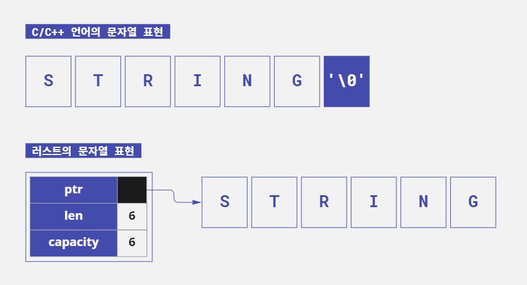

#패스트캠퍼스, #국비지원교육, #메가바이트스쿨, #MegabyteSchool, #개발자취업부트캠프, #내일배움카드

*last edited 2023.02.03*

# 러스트의 문자열에 대해 쉬운 설명으로 알아보자

> ▶ 만들면서 배우는 러스트 프로그래밍 -쿠지라 히코우즈쿠에- ◀ 을 참조하여 정리하였다.

러스트의 문자열인 `String`과 `&str`이 어떻게 다른지 알아보자. 그리고 아시아 언어에서 주로 사용되는 멀티 바이트 문자는 어떻게 다뤄야 할지 확인해보자.

## 러스트의 문자열

러스트에서 문자열을 다룰 때 `String` 타입 또는 `&str`타입을 이용한다. 소스 코드에서 큰따옴표(`"`)로 문자열을 감싸는 경우 문자열 리터럴 타입은 `&str`이 된다.

`&str`은 변경이 불가능하다. 그래서 값을 변경하거나 함수의 반환 값으로 사용해야 하는 경우에는 `String`타입을 사용한다.

### String 타입은 벡터

`String`타입은 러스트 내부에서 `Vec<u8>`타입으로 취급된다. `Vec`은 가변 길이의 배열인 벡터 타입이다. 그리고 `u8`은 부호가 없는 8비트 정수, 즉 1바이트 정수다. 즉 `String`타입은
1바이트 단위로 데이터를 확장할 수 있다. 벡터 타입은 힙 메모리에 저장되므로 확장 가능한 문자열 객체이다.

### &str 타입은 슬라이스

소스 코드에서 큰따옴표로 감싼 문자열이 `&str`이다. `&str`은 러스트 내부에서 슬라이스인 `&[u8]`타입으로 취급된다. 슬라이스는 배열의 일부 또는 전체를 참조자로 이용할 수 있는 데이터 타입이다. 그리고
참조자이므로 소유권과 관련이 없다.

### C/C++와의 차이점

C 언어에서도 문자열은 1바이트 단위의 가변 배열 데이터로 취급한다. 하지만 러스트는 C 언어와 달리 문자열 끝에 `NULL`(`\0`)이 없다. 벡터 타입이므로 바이트 수가 기록되어 안전하게 관리된다.



- C 언어에서는 문자열의 끝이 `NULL`(`\0`)이므로 문자열 크기를 알려주지 않으면 알 수 없음
- 러스트에서는 처음부터 문자열의 실제 길이(length)와 메모리에 저장되는 크기(capacity)가 기록됨

## 러스트의 문자열은 UTF-8

러스트에서 다루는 문자열은 `String` 타입이건 `&str` 타입이건 문자 인코딩은 UTF-8로 정해져 있다. UTF-8은 Unicode/UCS로 정의된 문자 집합을 표현하는 문자 인코딩(부호화 방식/문자 코드)
이다.

UTF-8의 특징 중 하나는 1글자를 표시하기 위해 1바이트에서 6바이트 사이의 가변 길이를 이용한다는 점이다. 알파벳이나 숫자는 1바이트를 차지하지만 한글이나 일본어는 3바이트를 차지한다.<sup>*</sup>

<sup>*</sup>유니코드로는 2바이트지만 UTF-8로 표현할 때 3바이트가 된다. 따라서 UTF-8 인코딩을 기본으로 사용하는 러스트에서는 인덱스보다 인덱스의 범위를 지정할 수 있는 슬라이스를 기본적으로
사용한다.

`String`이 `Vec<u8>`이고 `&str`이 `&[u8]`이므로 문자열에서 임의의 1바이트에 접근하는 것도 가능하다. 하지만 **바이트 단위로 접근할 때에는 N바이트째가 N글자에 해당하지 않을 수 있다**는
점도 기억해둬야 한다.

영어 문자열과 바이트열이 대응하는 것을 확인해보자. 'Rust'라는 문자는 다음과 같이 대응된다. 바이트열은 16진수로 표기된다.

- 'Rust'라는 문자열을 바이트로 표시

| 문자열  | R   | u   | s   | t   |
|------|-----|-----|-----|-----|
| 바이트열 | 52  | 75  | 73  | 74  |

영어와 숫자는 UTF-8과 ASCII 코드가 동일하다. 그리고 N바이트째 문자는 N번째 문자가 된다.

다음은 '러스트'라는 UTF-8 문자열을 바이트로 표시한 것이다.

- '러스트'라는 문자열을 바이트로 표시

| 문자열  | 러        | 스        | 트        |
|------|----------|----------|----------|
| 바이트열 | eb 9f ac | ec 8a a4 | ed 8a b8 |

'러'는 16진수 바이트로 표시하면 'eb 9f ac'의 3바이트, '스'는 'ec 8a a4'의 3바이트, '트'는 'ed 8a b8'의 3바이트다. 즉 문자열에서 2바이트째 값을 가져와도 '스'라는 문자에
해당하는 것이 아니라 '러'의 2바이트째인 '9f'라는 데이터를 가져오는 것이다.

러스트의 문자열 `String`및 `&str`에는 문자 단위로 데이터를 가져오는 `chars` 메서드와 바이트 단위로 데이터를 가져오는 `bytes` 메서드가 있다. 이 두 메서드의 차이점에 대해 알아보자.

### 문자열에서 문자 한 개씩 가져오기

문자열을 하나 만든 뒤 임의의 곳에서 문자 한 개를 가져오는 프로그램을 만들어보자. 러스트는 문자열이 `Vec<u8>` 타입이라는 것을 알아두자. `u8`은 부호가 없는 8비트 정수이므로 영어나 숫자 1문자를 저장할
수 있지만 한글은 3바이트(32비트)이므로 저장할 수 없다.

```rust, noplayground
fn main() {
    let s = "안녕하세요";
    println!("{}", s[0]);  // 직접 n번째 문자를 가져올 수 없다.
}
```

위 소스 코드를 컴파일하면 에러가 발생한다.

```text
$ rustc str_index_err.rs && str_index_err
error[E0277]: the type `str` cannot be indexed by `{integer}`
 --> str_index_err.rs:3:22
  |
3 |     println!("{}", s[0]);  // 직접 n번째 문자를 가져올 수 없다.
  |                      ^ string indices are ranges of `usize`
  |
  = help: the trait `SliceIndex<str>` is not implemented for `{integer}`
  = note: you can use `.chars().nth()` or `.bytes().nth()`
          for more information, see chapter 8 in The Book: <https://doc.rust-lang.org/book/ch08-02-strings.html#indexing-into-strings>
  = help: the trait `SliceIndex<[T]>` is implemented for `usize`
  = note: required for `str` to implement `Index<{integer}>`

error: aborting due to previous error
```

이 에러 메시지에서 눈여겨볼 부분은 `note` 부분이다.

```text
  = note: you can use `.chars().nth()` or `.bytes().nth()`
  (`.chars().nth()` 또는 `.bytes().nth()`을 이용할 수 있다.)
```

러스트에서는 문자열을 저장한 변수에 직접 `s[N]`과 같은 형태로 접근할 수 없으니, 그 대신 `chars` 또는 `bytes` 메서드를 이용하라는 조언이다.

`chars` 메서드는 문자열을 UTF-8 기반으로 1글자씩 분할한 반복자를 반환한다. 그리고 `bytes` 메서드는 단순히 1바이트 단위로 분할한 반복자를 반환한다.

즉, 1글자씩 가져올 것인지 1바이트씩 가져올 것인지를 명확히 해 그에 맞는 메서드를 선택해야 한다.

러스트의 컴파일 에러 메시지는 이처럼 자세한 정보를 알기 쉽게 표시해주므로 에러 메시지를 읽는 것만으로 대부분의 에러를 해결할 수 있다. 이제 이 조언을 바탕으로 프로그램을 수정해보자. 다음은 `chars` 메서드를
이용해 1글자를 가져와 출력하는 예다.

```rust, editable
fn main() {
    let s = "안녕하세요";
    
    // 첫 1글자를 가져온다.
    let ch = s.chars().nth(0).unwrap();
    println!("{}", ch);  // 안
    
    // 3번째 글자를 가져온다.
    let ch = s.chars().nth(2).unwrap();
    println!("{}", ch);  // 하
}
```

컴파일 후 실행해보면 1번째 문자 '안'과 3번째 문자 '하'가 출력된다.

## &str에 슬라이스 사용

앞의 문제를 다르게 해결하는 방법도 있다. `&str`에 대해 슬라이스를 이용하는 방법이다. 문자 단위가 아니라 바이트 단위로 지정한 문자열을 가져올 수 있다. `&str`에서 특정 부분의 값을 가져올 때 사용한다.

```rust, editable
fn main() {
    // 첫 번째 글자를 출력 (1)
    let s2 = "abcdefg";
    println!("{}", &s2[0..1]);  // a
    
    let s = "안녕하세요";
    
    // 첫 번째 1글자를 출력 (2)
    let ch = &s[..3];
    println!("{}", ch);  // 안
    
    // 세 번째 1글자를 출력 (3)
    let ch = &s[6..9];
    println!("{}", ch);  // 하
}
```

컴파일 후 실행하면 `&str`을 슬라이스해 취득한 데이터가 문자열로 출력된다. 이때 바이트 단위를 잘 지정해야 한다. 올바르지 않게 지정한 경우 컴파일 단계에서 에러가 발생한다.

1. 영문 문자열이므로 `[0..1]` 또는 `[..1]` 과 같은 형태로 첫 번째 글자의 바이트를 가져올 수 있다.
2. 한글이므로 첫 3바이트(1글자)를 가져온다. 그리고 해당 3바이트를 문자로 출력한다.
3. 3번째 글자인 '하'를 출력하기 위해 `[6..9]`를 지정해 해당 3바이트를 가져와 문자로 출력한다.

## &str과 String 상호 변환

`&str`과 `String` 타입은 상호 변환이 가능하다. 실제 프로그램으로 확인해보자. 일반적으로 다음과 같은 프로그램은 타입 추론을 이용하므로 타입을 명시하지 않아도 상관없지만 여기서는 타입을 확실히 하기 위해
변수별로 타입을 명시했다.

```rust, editable
fn main() {
    // 문자열 리터럴은 &str 타입 (1)
    let ss: &str = "베풀면 반드시 돌아온다";
    
    // &str은 String으로 변환 (2)
    let so1: String = String::from(ss);
    let so2: String = ss.to_string();
    
    // String을 &str로 변환 (3)
    let ss2: &str = &so1;
    let ss3: &str = so1.as_str();
    
    // 출력
    println!("{}\n{}\n{}\n{}", so1, so2, ss2, ss3);
    
    // 참조 타입 포인터 주소를 표시 (4)
    println!("{:p}\n{:p}", ss2, ss3);
}
```

컴파일 후 실행해보면 지정한 문장이 4번 출력되고 `&str`이 가리키는 참조 주소가 표시된다.

1. 문자열 리터럴을 변수 `ss`에 대입한다. 이때 문자열 리터럴 타입은 `&str`이다.
2. `&str`타입을 `String` 타입으로 변환한다. `&str`타입을 `String` 타입으로 변환하는 방법은 소스 코드와 같이 2가지가 있다. 이렇게 해서 `String` 객체(인스턴스)를 생성한다.
3. `String`을 다시 `&str`형식으로 변환한다. 이처럼 `&str`과 `String` 변환은 쉽게 할 수 있다.
4. 참조자 확인용 코드로 (3)에서 참조 타입 `&str`이 현재 가리키는 주소를 출력한다. `println!`에 `"{:p}"`를 지정하면 포인터가 가리키는 주소를 출력할 수 있다. '포인터 주소'란 해당 값이
   할당된 메모리상의 주소를 말한다.

`String` 타입은 힙 메모리에 저장되므로 할당된 주소는 실행할 때마다 달라진다. `String` 타입의 참조자와 `as_str` 메서드로 얻을 수 있는 참조자가 같은 주소를 가리키므로 두 값이 같음을 알 수
있다.

### 문자열을 1바이트씩 출력

상황에 따라서는 문자열을 1바이트씩 잘라 이용하거나 바이너리 데이터를 이용해야 하는 경우도 있다. 여기서는 문자열을 1바이트씩 잘라 내용을 표시해보자. 앞에서 언급한 `bytes` 메서드를 이용해 문자열을 1바이트씩
표시해본다.

```rust, editable
fn main() {
    let pr = "러스트";
    
    // 1바이트씩 출력 (1)
    for c in pr.bytes() {
        print!("{:2x} ", c);
    }
    
    // 바이트 수 구하기 (2)
    println!("\n바이트 = {}B", pr.len());
}
```

프로그램을 실행하면 문자열이 바이트 데이터로 출력된다.

```text
$ rustc str_tobytes.rs && ./str_tobytes
eb 9f ac ec 8a a4 ed 8a b8 
바이트 = 9B
```

1. `for` 문으로 `bytes` 메서드를 이용해 문자열을 1바이트씩 출력한다. `bytes` 메서드는 반복자를 반환하므로 `for`문을 이용할 수 있다.
2. `len` 메서드를 이용해 바이트 수를 표시한다. 러스트에서 실수하기 쉬운 것 중 하나는 `&str`의 `len` 메서드다. `&str`의 `len`메서드는 문자 길이가 아니라 바이트 길이를 반환한다.

> #### 러스트에서 착각하기 쉬운 점 - 문자 수와 바이트 수
>
> `&str`의 `len` 메서드는 문자열이 아니라 바이트 길이를 반환한다. `abc`와 같이 영어 문자열에 `len` 메서드를 이용하면 3을 반환하지만 `맛있다`라는 한글에 `len` 메서드를 이용하면 9를
> 반환한다.

### 문자열을 1자씩 출력

이번에는 문자열에서 문자 단위로 구분해 출력해보자. 문자 단위를 다루기 위해서는 `chars` 메서드를 이용한다.

```rust, editable
fn main() {
    let pr = "구슬이 서 말이라도 꿰어야 보배";

    // 1자씩 표시 (1)
    for c in pr.chars() {
        print!("[{}]", c);
    }

    // 글자 수를 세기 (2)
    println!("\n글자 수 = {}자", pr.chars().count());

    // Vec<char>로 변환해 처리 (3)
    let pr_chars: Vec<char> = pr.chars().collect();
    println!("Vec<char> : {:?}", pr_chars);
    for c in pr_chars.iter() {
        print!("({})", c);
    }
    println!("\n글자 수 = {}자", pr_chars.len());
}
```

컴파일 후 실행해보면 문자열 안의 문자가 1자씩 출력된다.

1. `&str`의 `chars` 메서드와 `for`문을 이용해 대괄호(`[]`)에 넣어 1자씩 출력한다.
2. 글자 수를 센다. `chars` 메서드는 반복자를 반환하므로 `count` 메서드를 이용하면 요소의 수를 셀 수 있다.
3. `chars` 메서드를 이용해 `Vec<char>` 타입으로 변환한 뒤 문자열을 처리한다. 벡터의 `iter` 메서드와 `for` 문을 이용해 1자씩 처리할 수 있다. 여기서 변수 `pr_chars`는 이미
   글자별로 분리된 벡터 타입이므로 `len` 메서드를 이용하면 바이트 수가 아니라 글자 수(즉 벡터의 길이)를 반환한다.

`u8`이 기호 없는 8비트 정수(1바이트)로 문자를 표현하는 반면 `char` 타입은 32비트(4바이트)로 1문자를 표시한다. 이 부분에서도 러스트의 언어적 성격을 엿볼 수 있다. 처음부터 `Vec<char>`를
문자열 내부 표현으로 하는 것이 아니라 `Vec<u8>`을 문자열로 표현한다. 그리고 필요에 따라 `Vec<char>`로 변환해 처리 한다.

## 라이프타임

수명(Lifetime)이라면 보통 생애, 생존 기간을 의미한다. 러스트에서의 라이프타임은 값을 참조할 수 있는 범위(Scope)를 의미한다. 라이프타임은 아포스트로피(`'`)를 붙여 표현한다. 그리고 대부분
소문자만을 이용하여 짧은 영문자 한 개(`a` 등)를 이용하는 경우가 많다.

값이 일반적인 라이프타임 범위를 가지고 있다면 컴파일러는 값의 유효 범위(라이프타임)를 추론할 수 있다. 따라서 라이프타임 지시자를 생략할 수 있다. 하지만 라이프타임 지시자를 반드시 지정해야 하는 경우도 있다.

참고로 가장 긴 라이프타임을 가지는 것은 `'static`이다. 이것은 러스트 프로그램이 시작할 때부터 종료될 때까지 존재한다. 문자열 리터럴의 타입은 `&str`이지만 라이프타임을 명시하는
경우 `&'static str`과 같이 기술한다.

다음은 `echo`함수를 정의해서 이용하는 프로그램으로 `&'static str`타입을 인수로 받아 처리한다.

```rust, editable
// &'static str을 이용하는 함수 (1)
fn echo(s: &'static str) {
    println!("{}", s);
}

fn main() {
    // 문자열 리터럴(&'static str)을 지정 (2)
    echo("웅변은 은이요");
    echo("침묵은 금이다");
    
    // 아래 주석 부분은 에러가 발생한다 (3)
    // let s = String::from("테스트");
    // echo(&s);
}
```

컴파일 후 실행해보면 `echo`함수 안에 지정한 문자열이 출력된다.

1. 함수를 보면 라이프타임 지시자를 붙여 `&'static str`을 인수로 지정했다. 즉 `&str`타입이며 `'static`라이프타임을 가진 참조자만을 인수로 사용할 수 있다.
2. 큰따옴표로 이루어진 문자열을 지정했는데 이는 `&str`타입이다. 그리고 `&str`타입은 `'static`이 생략됐다. 즉 함수의 인수로 라이프타임이 `'static`인 문자열 리터럴을 지정했다. 따라서
   문제없이 문자열 리터럴 내용이 출력된다.

주석 처리된 (3) 부분의 주석을 해제한 뒤 실행해보자. 변수 `s`의 참조자인 `&s`는 `main`함수 안에서만 살아있을 수 있다. 따라서 `'static`보다 짧은 라이프타임을 가지므로 `echo`함수에서
호출하면 에러가 발생한다. 함수의 인수에 라이프타임 지시자를 지정한 경우 그보다 짧은 라이프타임을 가진 값을 사용할 수 없기 때문이다.
